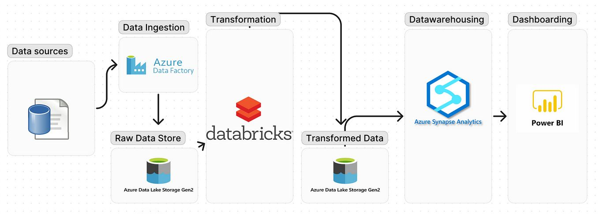

# **System Requirements Specification (SRS) for Personal Growth Data Pipeline**

## **Introduction**

### Purpose
The pipeline will track personal growth metrics, focusing on skill development, contributions to the data engineering community, and professional development.

### Scope
The scope of this project is to:
- Build a data pipeline to track and monitor personal growth metrics.
- Generate analytical reports from the collected data.
- Integrate machine learning models for predictive insights and recommendations.
- Ensure scalability, security, and reliability, with automated validation and error handling.

## **1. Functional Requirements**
*This section outlines the functionality of the personal growth data pipeline, including data ingestion, transformation, machine learning, and analytics. The system is flexible and adaptable as growth metrics evolve.*

### **Category 1: Data Pipeline**

- **Requirement 1**: Ingest data from multiple sources (e.g., LinkedIn, Substack, GitHub).
    - Support various data formats and accommodate real-time or batch ingestion.
    - Ensure flexible expansion for new sources.

- **Requirement 2**: Standardize raw data for analysis.
    - Handle data cleaning and transformation to produce standardized formats.

- **Requirement 3**: Store processed data for querying and analysis.
    - Support scalable data lake/warehousing and historical retention.

- **Requirement 4**: Serve real-time data insights for dashboards.
    - Enable dashboards to visualize data with customizable views.

### **Category 2: Machine Learning Models**

- **Requirement 1**: Develop models for predictive insights on personal growth data.
    - Predict future trends using historical data.

- **Requirement 2**: Integrate models into the pipeline.
    - Ensure models are incorporated for real-time or batch predictions.

- **Requirement 3**: Support automated retraining and explainability.
    - Retrain models based on new data and provide transparent predictions.

### **Category 3: Personal Growth Analytics**

- **Requirement 1**: Track growth across key areas.
    - Support flexible tracking and adaptation as growth priorities evolve.

- **Requirement 2**: Generate flexible reports on growth trends.
    - Provide clear overviews of growth metrics with customizable views.

- **Requirement 3**: Offer insights and recommendations.
    - Analyze historical data for personalized insights.

- **Requirement 4**: Enable real-time, interactive dashboards.
    - Provide up-to-date dashboards with filtering capabilities.

## **2. Non-Functional Requirements**
*This section outlines scalability, security, reliability, and data governance for the system to ensure consistent performance and safeguard personal data.*

### DataOps: Objective - Maximize Automation and Stability
- **Principle**: Prioritize automation to minimize failures and manual intervention.
    - Automate all stages (extraction, transformation, reporting) with error handling and CI/CD.

### Data Architecture
- **Principle**: Enable flexible scaling and modular updates.
    - Use scalable cloud infrastructure, decoupling components for independent updates.

### Data Security
- **Principle**: Safeguard data privacy and security.
    - Apply encryption and RBAC, with audit logs for sensitive data.

### Data Management
- **Principle**: Ensure data quality and traceability.
    - Enforce retention policies, track data lineage, and manage metadata.

### Orchestration
- **Principle**: Efficiently manage dependencies and task scheduling.
    - Use orchestration tools to manage tasks, with error handling and retry logic.

## **3. System Architecture**
*This section describes the architecture, including data extraction, transformation, warehousing, and reporting.*

- Data is extracted from sources using **Azure Data Factory** and stored in **Azure Data Lake Storage Gen2**.
- Data is transformed using **Azure Databricks** for personal growth analysis and stored in **Azure Synapse Analytics** for querying and reporting.
- **Power BI** provides interactive dashboards and reports, while machine learning models (using **Azure Machine Learning**) generate predictions on growth trends.

## **4. Testing and Validation**
*Testing will ensure the pipeline performs as expected, handles the expected data load, and meets user expectations.*

- **Unit Testing**: Test individual components in isolation.
- **Integration Testing**: Ensure components work together in the full pipeline.
- **Performance Testing**: Validate system load handling and efficiency.
- **Security Testing**: Ensure encryption and access control measures are functioning.

### Validation:
- **Data Validation**: Ensure processed data meets quality standards.
- **Business Rule Validation**: Ensure outputs align with personal growth objectives.

## **5. Key Deliverables:**

### Deliverables:
- A fully operational pipeline with automation, security, and privacy controls.
- Comprehensive analytical reports via Power BI, tracking growth metrics.
- Machine learning models predicting trends in growth and engagement.
- Detailed project scope and final review documents summarizing progress and lessons learned.

## **6. Assumptions and Risks**
### Assumptions:
- External APIs (LinkedIn, Substack) provide consistent data.
- Machine learning models use historical data for predictions.

### Risks:
- **Risk**: Data loss or corruption.
    - **Mitigation**: Backup and recovery strategies.
- **Risk**: Inconsistent data from external sources.
    - **Mitigation**: Data quality checks during ingestion.

## **7. Dependencies**
*Critical tools and external systems required for pipeline functionality.*

- Data Ingestion: Python, Azure Data Factory
- Storage: Azure Data Lake Storage Gen2, Azure Synapse Analytics
- Transformation: Azure Databricks, Python (pandas)
- Reporting: Power BI, Python (matplotlib, seaborn)
- Machine Learning: Python (scikit-learn, TensorFlow), Azure Machine Learning

## **8. Timeline**
### Phases:
- **Phase 1**: ELT Pipeline Setup
- **Phase 2**: Analytical Reporting
- **Phase 3**: Machine Learning Model Integration

## **9. Glossary**
*Defines technical terms and acronyms used throughout the document.*